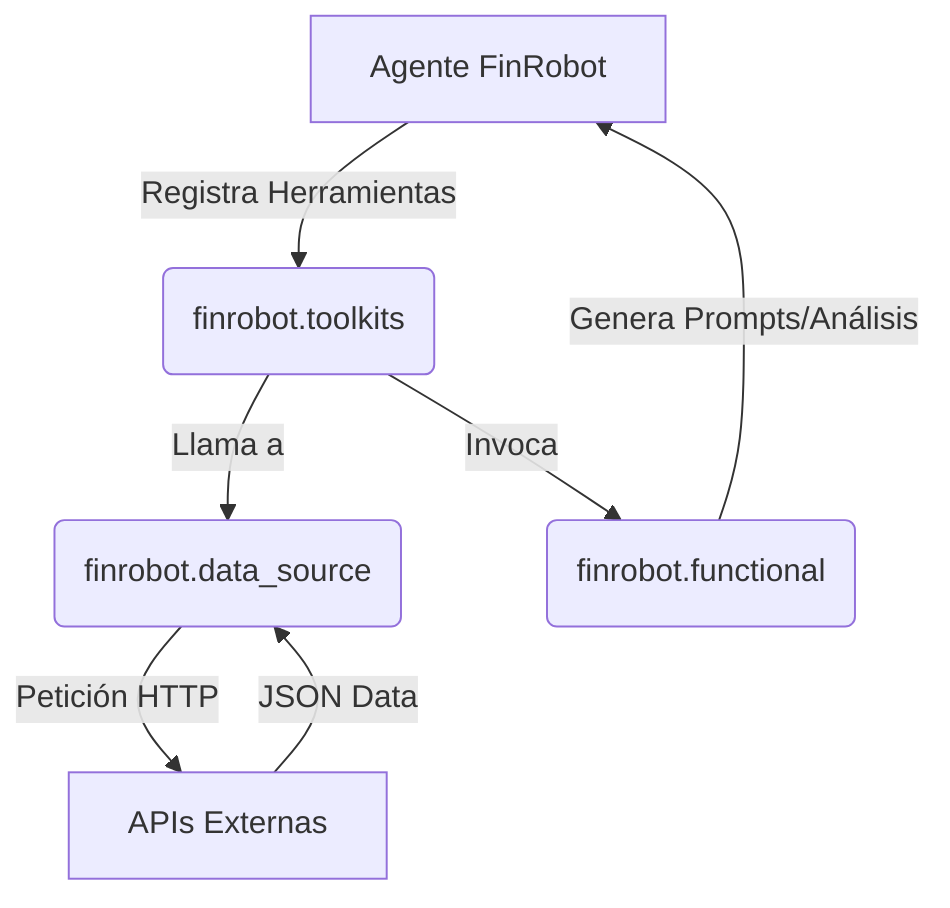

# Arquitectura Interna de FinRobot

FinRobot sigue una arquitectura modular enfocada en agentes de IA que actúan basándose en herramientas de acceso a datos (`toolkits`), lógica financiera (`functional`) y una orquestación flexible (`agents`).

## 1. Visión General de Capas

- **Capa de Agentes (`finrobot.agents`)**: Orquesta la ejecución y el diálogo de los agentes. En lugar de interaccionar directamente con datos en crudo, estos interactúan a través de herramientas registradas.
- **Capa de Lógica Funcional (`finrobot.functional`)**: Contiene algoritmos de análisis financiero, generación inteligente de 'prompts' y utilidades (por ejemplo, `analyzer.py` formatea las instrucciones para los LLMs).
- **Capa de Fuentes de Datos (`finrobot.data_source`)**: Clases y funciones que envuelven proveedores de datos externos (Yahoo Finance, FMP, SEC, etc.). Todas estas funciones son expuestas y encapsuladas.
- **Capa de Envoltura (`finrobot.toolkits`)**: Registra la funcionalidad de `data_source` y `functional` preparándola como herramientas para los agentes definidos en AutoGen.

### Diagrama de Flujo Básico



## 2. Orquestación de Agentes (`workflow.py` y `agent_library.py`)

- **Agent Library**: En `agent_library.py` se definen roles preconfigurados (ej. `Market_Analyst`). Las plantillas estandarizan el "System Message".
- **Workflows (`workflow.py`)**:
  - `SingleAssistant`: Agente que ejecuta lógica interaccionando individualmente con un _UserProxyAgent_ usando las herramientas.
  - `MultiAssistant`: Orquesta _GroupChats_ en AutoGen para resolver tareas donde varios roles (por ejemplo, Analista y Gestor) colaboran bajo la mediación de un sistema automatizado.

## 3. Guía para Extender FinRobot

Para hacer crecer las capacidades del sistema, los desarrolladores pueden interactuar con estas capas de manera ordenada:

### A. Añadir una Nueva Fuente de Datos
1. **Crear archivo en `finrobot/data_source`**: Crea un módulo (ej. `nuevaapi_utils.py`). Implementa una clase vacía o hereda utilidades y agrupa debajo las funciones como `@classmethod`.
2. **Anotaciones de Tipo Obligatorias**: Usa _Type Hints_ y `Annotated` obligatoriamente (ej. `ticker: Annotated[str, "Symbol"]`), ya que AutoGen las lee para construir las descripciones de las herramientas del LLM.
3. **Manejo de Errores**: Todo método de acceso a la red debe tener un bloque `try/except`.

### B. Registrar la Herramienta en los Toolkits
1. Ve al bloque correspondiente en `finrobot/toolkits.py` (o dentro de tu workflow específico), y usa la función de registro de Automagica/AutoGen:
   ```python
   def register_mi_nueva_herramienta(agent, user_agent):
       register_function(NuevaApiUtils.mi_funcion, caller=agent, executor=user_agent, ...)
   ```

### C. Añadir un Nuevo Rol de Agente
1. Navega al fichero base de configuración de librerías (`agent_library.py` o los `.json` si se exteriorizan).
2. Define un `role_name`, un `system_message` rico, y opcionalmente asocia una lista de toolkits por defecto.
3. El motor instanciará a este agente pasándolo bajo el rol recién creado.
