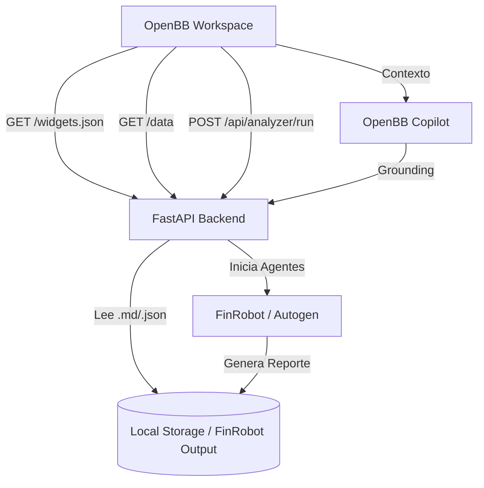

# FinRobot OpenBB Backend

Este proyecto proporciona un backend personalizado para **OpenBB Workspace** que integra las capacidades de análisis de **FinRobot**. Permite visualizar carteras, listas de seguimiento (radar), gráficos históricos y reportes detallados generados por agentes de IA directamente dentro de la interfaz de OpenBB Pro.

## Arquitectura

El sistema se basa en una arquitectura de microservicios locales:

1.  **FinRobot Core (Autogen)**: Agentes de IA (`Data`, `Analyst`, `Manager`) que realizan RAG (Retrieval-Augmented Generation) sobre datos financieros locales y de APIs externas.
2.  **FastAPI Backend**: Un servidor web que actúa como puente, estructurando los resultados de los agentes para el consumo de OpenBB.
3.  **OpenBB Workspace**: El frontend que renderiza los widgets y permite la interacción del usuario.

### Diagrama de Flujo



## Widgets Implementados

El archivo `widgets.json` define cuatro componentes clave:

- **Cartera de Inversión (AgGrid)**: Muestra tus activos reales. Incluye `cell_click_grouping` para que al seleccionar una fila, los demás widgets se sincronicen con el ticker seleccionado.
- **Radar de Acciones (AgGrid)**: Lista de seguimiento con alertas y calificaciones de FinRobot.
- **Reporte FinRobot (Markdown)**: Renderizado visual de los informes exhaustivos. Soporta formato enriquecido.
- **Evolución Precio (Plotly)**: Gráfico de velas interactivo generado dinámicamente mediante `yfinance`.
- **Lanzador de Análisis (Input Form)**: Interfaz para solicitar nuevos análisis a la IA.

## Lógica de Integración

### Grounding e Inteligencia Artificial
La integración utiliza el **Model Context Protocol (MCP)** implícito y explícito. Al definir los esquemas de datos en los widgets, el **Copilot de OpenBB** puede leer las tablas como datos estructurados en lugar de simple texto, eliminando alucinaciones y permitiendo razonamiento cuantitativo sobre tu cartera.

### Sincronización (Cell Click Grouping)
Hemos configurado los widgets para que compartan el parámetro `finrobot_symbol`.
- La **Tabla de Cartera** emite este parámetro al hacer clic en una celda.
- El **Widget de Análisis** y el **Gráfico** escuchan este parámetro y refrescan sus datos automáticamente.

## Instalación y Uso

### Requisitos
- Python 3.10+
- `uv` (recomendado) o `pip`
- OpenBB Pro (Desktop o Web)

### Ejecución
Desde la raíz del proyecto `FinRobot-master`:

```bash
# Activar entorno
source OpenBB/.venv/bin/activate

# Entrar al backend
cd finrobot-backend

# Iniciar servidor
uvicorn main:app --port 8080
```

### Configuración en OpenBB Pro
1. Ve a **OpenBB Pro Workspace**.
2. Entra en **Data Integrations** (o el icono de engranaje de desarrollador).
3. Añade la URL del backend: `http://localhost:8080/widgets.json`.
4. (Opcional) Añade la App: `http://localhost:8080/apps.json`.
5. Busca en tu galería de Apps el panel **FinRobot Central**.

## Estructura de Archivos
- `main.py`: Lógica del servidor y endpoints.
- `widgets.json`: Definición de la interfaz para OpenBB.
- `apps.json`: Configuración del Dashboard pre-construido.
- `data/`: Base de datos local en formato JSON.
